# 02 — RAG Explorer — Deep Dive

**Subsystem B** is a fully auditable Retrieval-Augmented Generation (RAG) pipeline. Unlike the chatbot, it retrieves relevant knowledge from a vector store at query time. This makes every answer traceable — you can see exactly which chunks were retrieved and why.

---

## 1. What It Does

The RAG Explorer demonstrates the full pipeline from document ingestion through grounded answer generation. Every stage is visible: you can inspect individual chunks, run pure retrieval without LLM generation, and see retrieval hit scores alongside the final answer.

---

## 2. RAG: The Core Idea

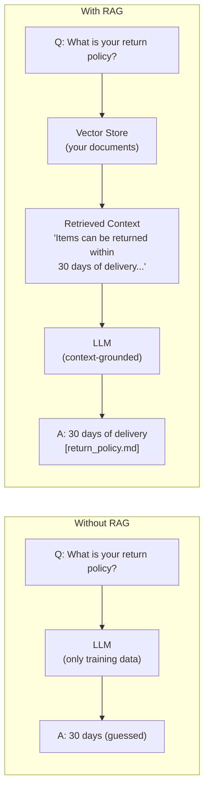

RAG = give the LLM real, current, company-specific knowledge at query time — instead of relying on its training data.

---

## 3. Tech Stack

| Layer | Technology | Purpose |
|-------|-----------|---------|
| Server | FastAPI | REST API + Jinja2 HTML pages |
| Embeddings | Ollama `nomic-embed-text` | Convert text → dense vectors (768-dim) |
| Vector store | ChromaDB (persistent) | Store and similarity-search embeddings |
| LLM | Groq `llama-3.3-70b-versatile` | Generate grounded answers from context |
| Fallback (embed) | Hash-based deterministic | When Ollama is unavailable |
| Fallback (store) | In-memory search | When ChromaDB fails |
| Fallback (LLM) | Mock reply | When `GROQ_API_KEY` is absent |

---

## 4. Full Pipeline Diagram

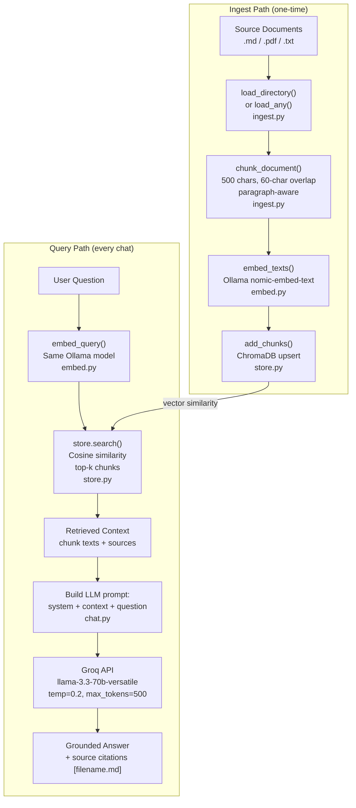

---

## 5. Module Architecture

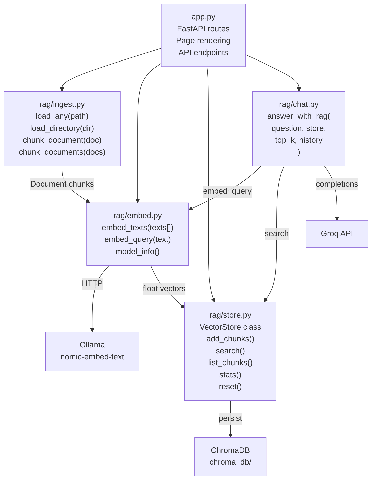

---

## 6. Ingest Stage — Chunking Details

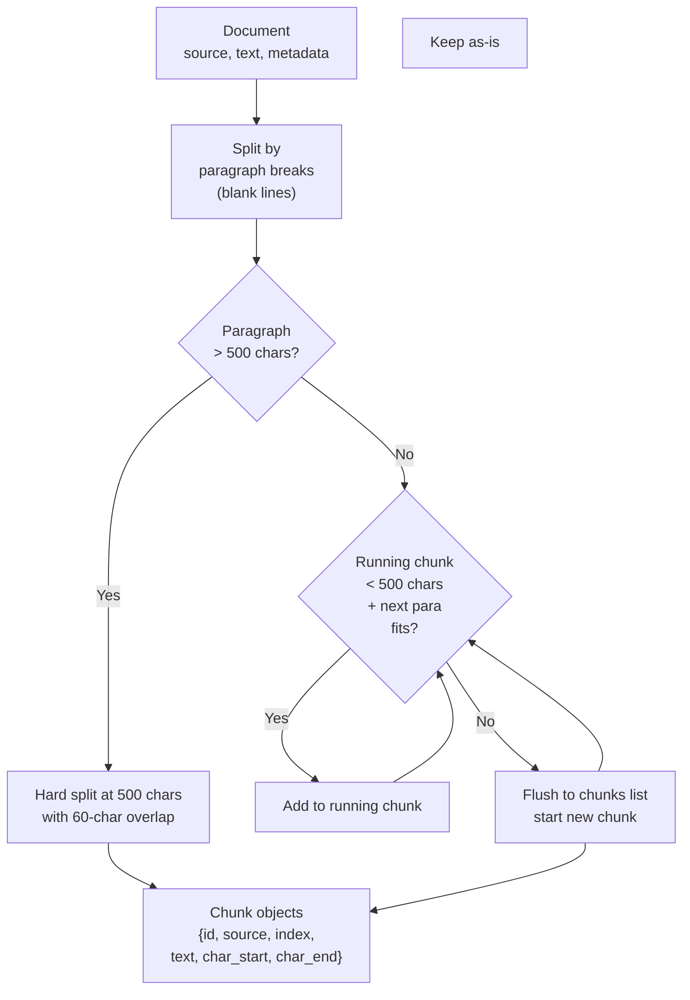

**Parameters:**
- Chunk size: 500 characters
- Overlap: 60 characters (preserves context across boundaries)
- Strategy: paragraph-aware (splits on blank lines first)

---

## 7. Embedding Stage

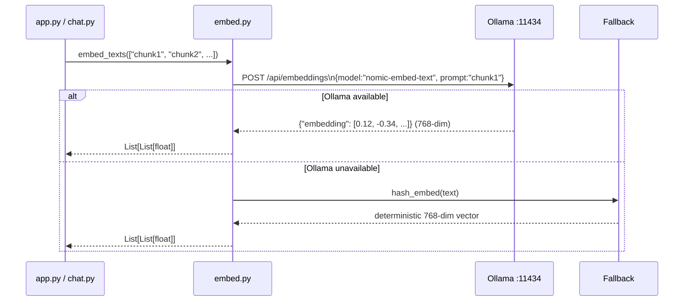

**`nomic-embed-text` properties:**
- 768-dimensional dense vectors
- Trained for semantic similarity
- English-focused, optimized for retrieval tasks

---

## 8. Vector Store Stage

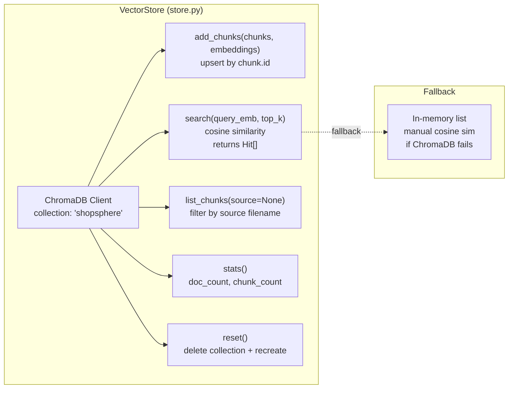

**ChromaDB persistence:** `chroma_db/` directory (configurable via `CHROMA_DIR` env var). Survives server restarts — you only need to ingest once.

---

## 9. Retrieval Stage — Similarity Search

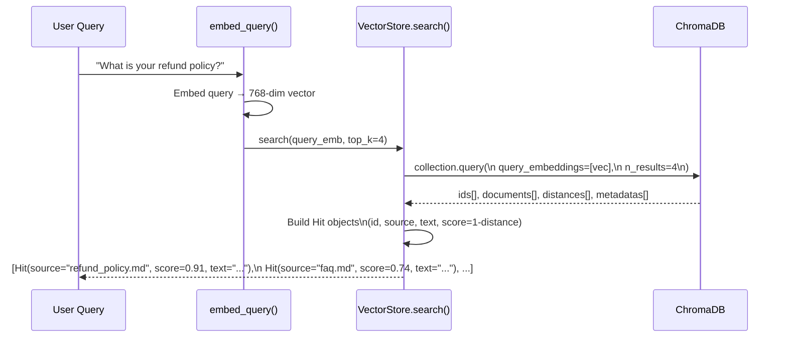

**Score formula:** `score = 1 - cosine_distance`. Ranges 0–1, higher = more similar.

---

## 10. Answer Generation Stage

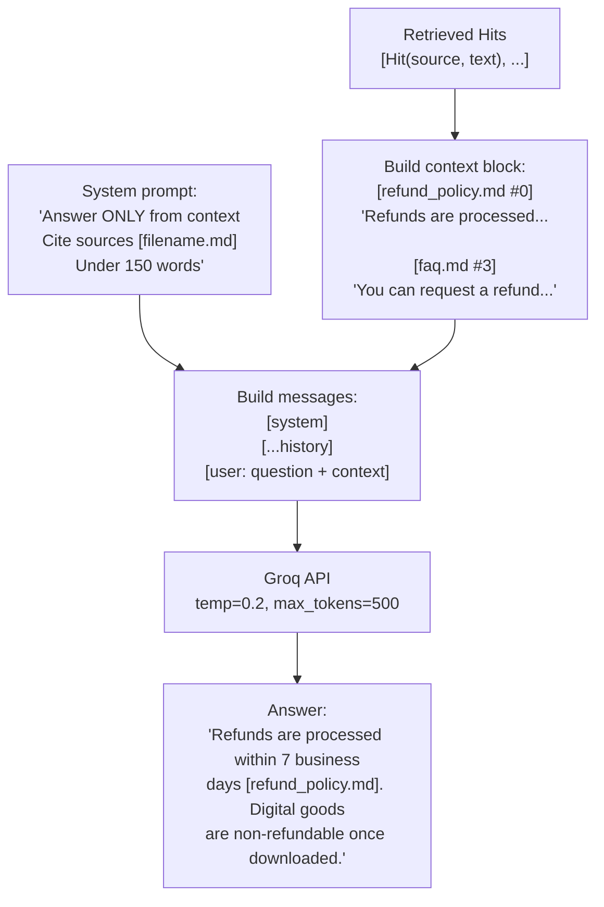

The LLM is instructed to:
1. Answer **only** from retrieved context
2. Cite sources inline: `[filename.md]`
3. Stay under 150 words
4. Say "I don't have that information" if context doesn't cover the question

---

## 11. Data Models

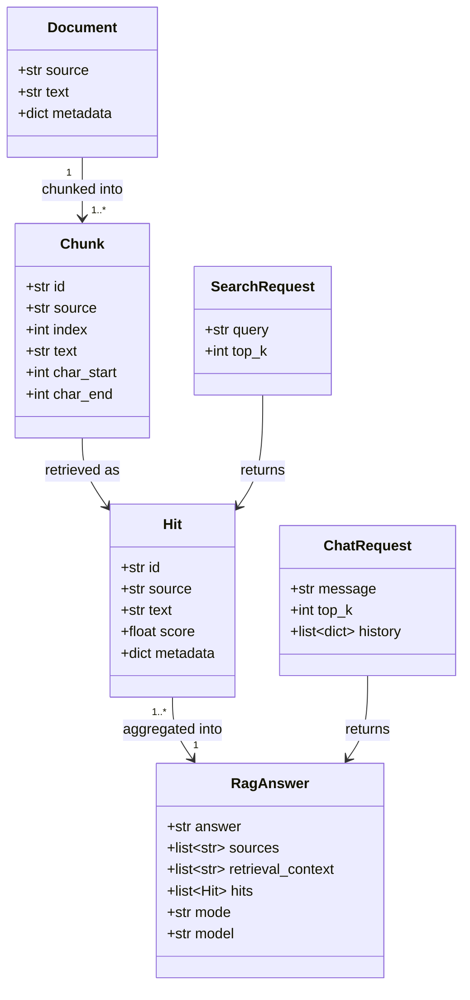

---

## 12. UI Pages

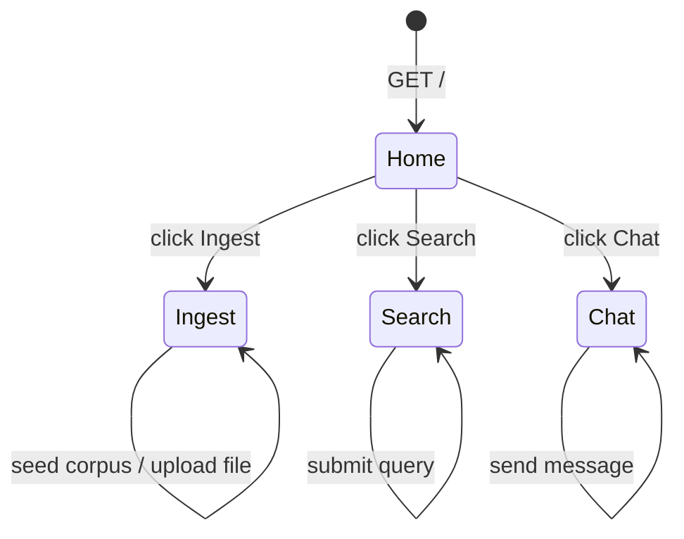

| Page | Path | What you see |
|------|------|-------------|
| **Pipeline Dashboard** | `/` | Stage diagram, store stats (chunk count, doc count, embed model status, Groq status) |
| **Ingest** | `/ingest` | Available corpus files, upload form, full chunk list with source and char positions |
| **Search** | `/search` | Query box, ranked hits with similarity scores — **no LLM involved** |
| **Chat** | `/chat` | Chat interface + collapsible retrieval panel showing the top-k chunks that informed the answer |

---

## 13. API Endpoints — Full Reference

### `GET /api/health`
```json
{
  "status": "ok",
  "stats": {"doc_count": 5, "chunk_count": 47},
  "embed": {"model": "nomic-embed-text", "available": true},
  "groq_configured": true
}
```

### `POST /api/ingest/seed?reset=false`
Seeds the bundled 5-document corpus. Pass `reset=true` to wipe the store first.
```json
{"added": 47, "documents": 5, "stats": {...}}
```

### `POST /api/ingest/upload`
Multipart form: `file` (PDF/MD/TXT) + `reset` (bool).
```json
{
  "added": 12,
  "source": "my_policy.md",
  "chunk_count": 12,
  "preview": ["First 160 chars of chunk 0...", "..."],
  "stats": {...}
}
```

### `POST /api/ingest/reset`
Wipes the entire vector store.
```json
{"status": "reset", "stats": {"doc_count": 0, "chunk_count": 0}}
```

### `POST /api/search`
```json
// Request
{"query": "How long does a refund take?", "top_k": 4}

// Response
{
  "query": "How long does a refund take?",
  "hits": [
    {"id": "refund_policy.md#0", "source": "refund_policy.md", "score": 0.9123,
     "text": "Refunds are processed within 7 business days...", "metadata": {...}},
    ...
  ]
}
```

### `POST /api/chat`
```json
// Request
{"message": "How long does a refund take?", "top_k": 4, "history": []}

// Response
{
  "answer": "Refunds are processed within 7 business days [refund_policy.md].",
  "sources": ["refund_policy.md"],
  "retrieval_context": ["Refunds are processed within 7 business days...", "..."],
  "hits": [{"id": "...", "source": "refund_policy.md", "score": 0.91, "text": "..."}],
  "mode": "live",
  "model": "llama-3.3-70b-versatile"
}
```

---

## 14. Bundled Corpus — Knowledge Base

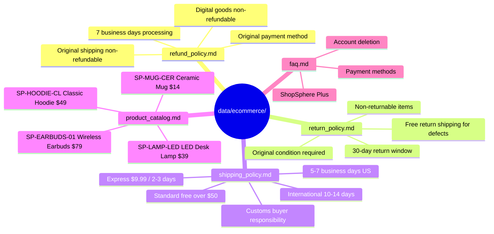

---

## 15. Graceful Degradation Chain

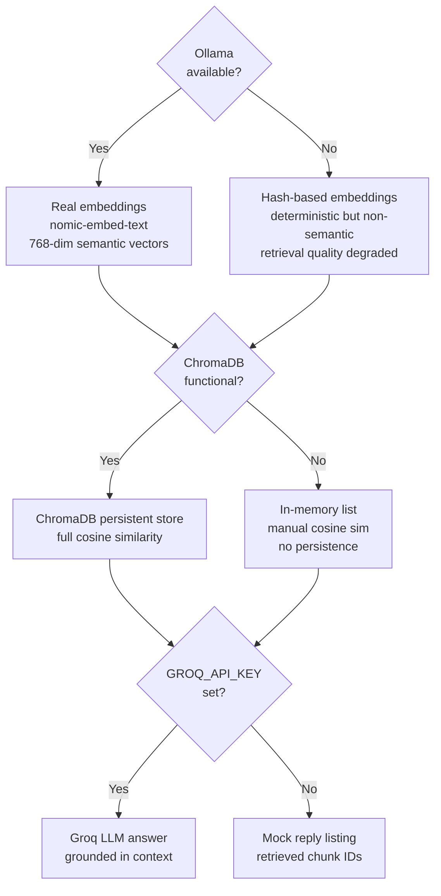

---

## 16. RAG Goldens (for DeepEval)

The evaluation framework uses 8 golden cases with expected context keywords and expected source files:

| Question | Expected Sources |
|----------|-----------------|
| "What is the refund processing time?" | `refund_policy.md` |
| "How long does standard shipping take inside the US?" | `shipping_policy.md` |
| "What items cannot be returned?" | `return_policy.md` |
| "Tell me about the SP-EARBUDS-01 earbuds." | `product_catalog.md` |
| "How much does express shipping cost?" | `shipping_policy.md` |
| "Are digital goods refundable?" | `refund_policy.md` |
| "What is ShopSphere Plus?" | `faq.md` |
| "Who pays for return shipping on defective items?" | `return_policy.md` |

---

## 17. Models Used

| Role | Model | Provider | File | Env Override |
|------|-------|----------|------|-------------|
| Text embedding | `nomic-embed-text` | Ollama | `rag/embed.py:13` | `EMBED_MODEL` |
| Answer generation (Groq) | `llama-3.3-70b-versatile` | Groq Cloud | `rag/chat.py:26` | `RAG_MODEL` |
| Answer generation (local) | `llama3.2:3b` | Ollama | `rag/chat.py:24` | `RAG_MODEL` |

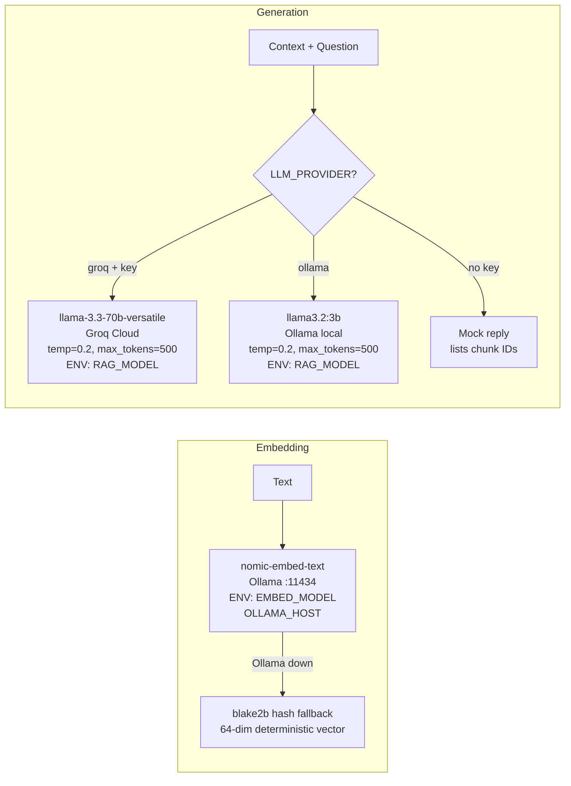

**Key differences from the chatbot's LLM settings:**

| Setting | Chatbot | RAG |
|---------|---------|-----|
| `temperature` | `0.3` | `0.2` — stricter grounding |
| `max_tokens` | `400` | `500` — longer context-grounded answers |
| Knowledge source | Hardcoded system prompt | Retrieved chunks at query time |

---

## 18. Environment Variables

| Variable | Default | Effect |
|----------|---------|--------|
| `GROQ_API_KEY` | — | Required for live answers; unset = mock mode |
| `RAG_MODEL` | `llama-3.3-70b-versatile` | Override Groq model for answer generation |
| `OLLAMA_HOST` | `http://localhost:11434` | Ollama server URL |
| `CHROMA_DIR` | `chroma_db/` | ChromaDB persistence directory |

---

## 18. Run Commands

```bash
# Start server
cd 02_rag_explorer
uvicorn app:app --reload --port 8202 --loop asyncio

# Seed the corpus via curl
curl -X POST "http://localhost:8202/api/ingest/seed?reset=true"

# Run a search
curl -X POST http://localhost:8202/api/search \
  -H "Content-Type: application/json" \
  -d '{"query": "refund policy", "top_k": 3}'

# Full RAG chat
curl -X POST http://localhost:8202/api/chat \
  -H "Content-Type: application/json" \
  -d '{"message": "How long do refunds take?", "top_k": 4}'
```
