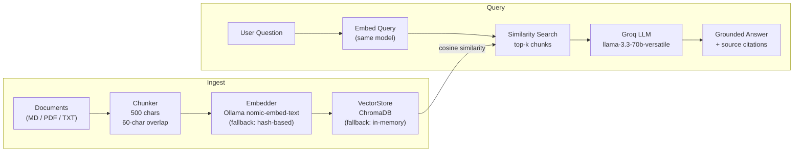
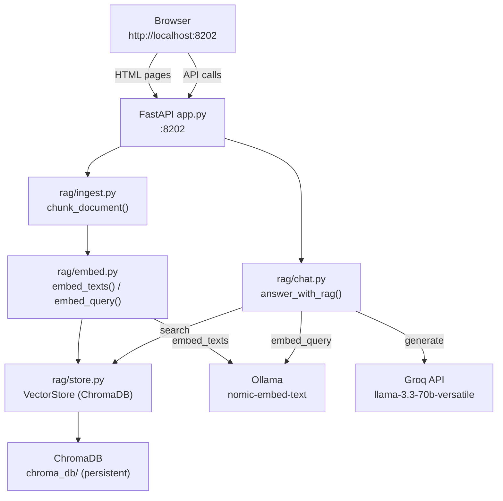
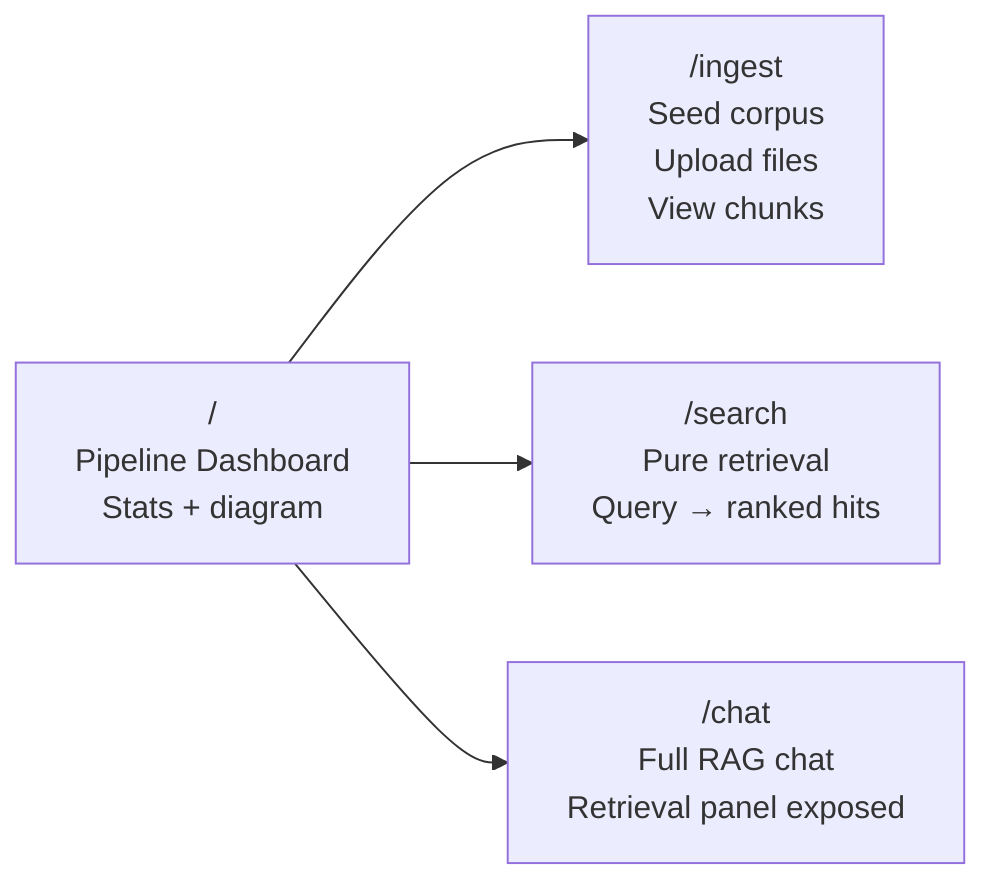
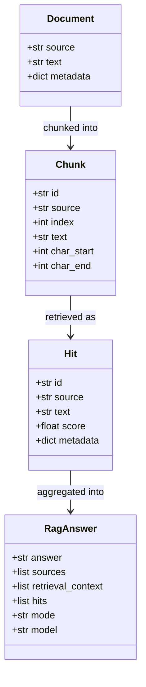

# Subsystem B — RAG Explorer

A complete, locally-runnable **Retrieval-Augmented Generation** pipeline with full visibility into every stage: ingest, chunk, embed, store, retrieve, and answer. Built on FastAPI + ChromaDB + Ollama + Groq.

---

## Why "Explorer"?

Most RAG demos hide retrieval behind the chat reply. This one **exposes every stage** so you can see raw chunks, similarity scores, and the grounded answer side by side. That auditability is exactly what DeepEval needs to measure retrieval quality, faithfulness, and hallucination.

---

## RAG Pipeline



---

## Architecture



---

## Port

`8202` — http://localhost:8202

---

## Prerequisites

```bash
# Ollama with nomic-embed-text
ollama pull nomic-embed-text

# Groq API key (optional — mock mode works without it)
export GROQ_API_KEY=gsk_...
```

---

## Run

```bash
cd 02_rag_explorer
pip install -r requirements.txt
uvicorn app:app --reload --port 8202 --loop asyncio
```

---

## Pages



| Path | What you can do |
|------|----------------|
| `/` | See pipeline stage diagram, store statistics (docs, chunks, embed model) |
| `/ingest` | Seed the bundled 5-doc corpus, upload your own PDF/MD/TXT, view all stored chunks |
| `/search` | Run a query and see ranked chunk hits with similarity scores — no LLM involved |
| `/chat` | Full RAG chat: query → retrieve → answer, with retrieved chunks shown below the reply |

---

## API Endpoints

| Method | Path | Body / Params | Response |
|--------|------|---------------|----------|
| GET | `/api/health` | — | status, stats, embed model, groq_configured |
| POST | `/api/ingest/seed` | `?reset=true\|false` | added count, document count, stats |
| POST | `/api/ingest/upload` | multipart `file`, form `reset` | added, source, chunk_count, preview |
| POST | `/api/ingest/reset` | — | status, stats |
| POST | `/api/search` | `{query, top_k}` | query, hits[] |
| POST | `/api/chat` | `{message, top_k, history?}` | answer, sources[], retrieval_context[], hits[], mode, model |
| GET | `/api/chunks` | `?source=filename` | chunks[] |
| GET | `/api/stats` | — | doc_count, chunk_count |

---

## Bundled Corpus

Five e-commerce knowledge files in `data/ecommerce/`:

| File | Content |
|------|---------|
| `refund_policy.md` | 7-day processing, original-payment refund, digital goods exception |
| `return_policy.md` | 30-day window, final-sale / underwear exclusions, free return shipping for defects |
| `shipping_policy.md` | Standard (free over $50, 5–7 days), Express ($9.99, 2–3 days), International (10–14 days) |
| `product_catalog.md` | 4 SKUs: earbuds $79, hoodie $49, mug $14, lamp $39 |
| `faq.md` | Payment methods, account deletion, ShopSphere Plus |

These are intentionally rich enough to stress-test retrieval precision, recall, and hallucination metrics.

---

## Data Models



---

## Graceful Degradation

| Component | Primary | Fallback |
|-----------|---------|---------|
| Embeddings | Ollama `nomic-embed-text` | Hash-based deterministic embeddings |
| Vector store | ChromaDB (persistent) | In-memory search |
| LLM answers | Groq `llama-3.3-70b-versatile` | Mock reply listing retrieved chunk IDs |

The pipeline remains fully functional end-to-end even with no external services running.

---

## How DeepEval Evaluates This Subsystem

Subsystem C calls this service via `RagClient` and builds `LLMTestCase` objects with `retrieval_context` from the `/api/chat` response:

| Metric | What is measured |
|--------|-----------------|
| Contextual Precision | High-quality chunks ranked above low-quality ones |
| Contextual Recall | Retrieved chunks cover all facts needed to answer |
| Contextual Relevancy | Most retrieved chunks are on-topic |
| Faithfulness | Every claim in the answer is grounded in retrieved context |
| Answer Relevancy | Answer stays on-topic for the question |
| Hallucination | Answer contradicts ground-truth expected output |
| G-Eval Correctness | Facts in answer match expected answer |
| G-Eval Citation Quality | Answer cites source filenames that match retrieved context |
| G-Eval Helpfulness | Answer is specific and actionable |
| Bias | Answer is free of biased statements |
| Toxicity | Answer is free of harmful language |

See [02_rag_explorer.md](../02_rag_explorer.md) for a detailed pipeline flow and diagrams.
