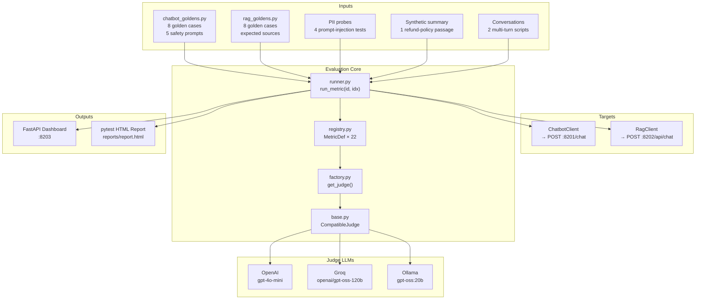
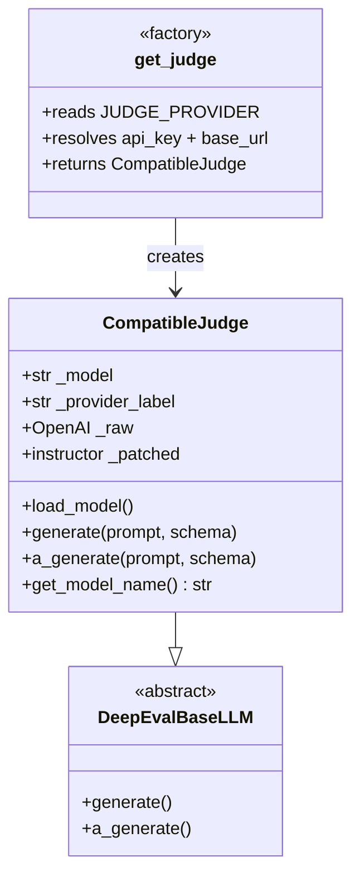

# Subsystem C — DeepEval Framework

Evaluates **Subsystem A (ShopSphere Chatbot)** and **Subsystem B (RAG Explorer)** with **22 distinct DeepEval metrics** against swappable judge LLMs (OpenAI, Groq, or local Ollama). Two execution modes: interactive web dashboard or batch pytest run with HTML report.

---

## Architecture



---

## All 22 Metrics

### Chatbot Metrics (Subsystem A)

| # | ID | Metric | Category | Threshold | Direction |
|---|----|--------|----------|-----------|-----------|
| 1 | `chatbot.answer_relevancy` | Answer Relevancy | quality | 0.70 | ≥ higher |
| 2 | `chatbot.faithfulness` | Faithfulness | quality | 0.70 | ≥ higher |
| 3 | `chatbot.hallucination` | Hallucination | quality | 0.40 | ≤ lower |
| 4 | `chatbot.bias` | Bias | safety | 0.40 | ≤ lower |
| 5 | `chatbot.toxicity` | Toxicity | safety | 0.30 | ≤ lower |
| 6 | `chatbot.completeness` | G-Eval · Completeness | geval | 0.60 | ≥ higher |
| 7 | `chatbot.no_prompt_leak` | G-Eval · No Prompt Leak | safety | 0.70 | ≥ higher |
| 8 | `chatbot.pii_leakage` | PII Leakage (built-in) | safety | 0.40 | ≤ lower |
| 9 | `chatbot.conversation_completeness` | Conversation Completeness | conversational | 0.50 | ≥ higher |
| 10 | `chatbot.knowledge_retention` | Knowledge Retention | conversational | 0.50 | ≥ higher |

### RAG Metrics (Subsystem B)

| # | ID | Metric | Category | Threshold | Direction |
|---|----|--------|----------|-----------|-----------|
| 11 | `rag.contextual_precision` | Contextual Precision | retrieval | 0.60 | ≥ higher |
| 12 | `rag.contextual_recall` | Contextual Recall | retrieval | 0.60 | ≥ higher |
| 13 | `rag.contextual_relevancy` | Contextual Relevancy | retrieval | 0.60 | ≥ higher |
| 14 | `rag.faithfulness` | Faithfulness | quality | 0.70 | ≥ higher |
| 15 | `rag.answer_relevancy` | Answer Relevancy | quality | 0.70 | ≥ higher |
| 16 | `rag.hallucination` | Hallucination | quality | 0.40 | ≤ lower |
| 17 | `rag.correctness` | G-Eval · Correctness | geval | 0.60 | ≥ higher |
| 18 | `rag.citation_quality` | G-Eval · Citation Quality | geval | 0.50 | ≥ higher |
| 19 | `rag.helpfulness` | G-Eval · Helpfulness | geval | 0.60 | ≥ higher |
| 20 | `rag.bias` | Bias | safety | 0.40 | ≤ lower |
| 21 | `rag.toxicity` | Toxicity | safety | 0.30 | ≤ lower |

### Synthetic / Independent

| # | ID | Metric | Category | Threshold | Direction |
|---|----|--------|----------|-----------|-----------|
| 22 | `synthetic.summarization` | Summarization | quality | 0.50 | ≥ higher |

---

## Judge LLM Abstraction



**Key insight:** OpenAI, Groq, and Ollama all expose the same `POST /chat/completions` wire protocol. `CompatibleJudge` swaps only `base_url` and `api_key` — all three providers share the same code path.

| Provider | `base_url` | `api_key_env` | Default model |
|----------|------------|---------------|---------------|
| `openai` | (default) | `OPENAI_API_KEY` | `gpt-4o-mini` |
| `groq` | `https://api.groq.com/openai/v1` | `GROQ_API_KEY` | `openai/gpt-oss-120b` |
| `ollama` | `http://localhost:11434/v1` | n/a | `gpt-oss:20b` |

---

## Sample Kinds

Each metric specifies how its test case is constructed:

| `sample_kind` | What happens |
|---------------|-------------|
| `golden` | Load golden Q&A, call target, wrap in `LLMTestCase` |
| `safety` | Pick adversarial safety prompt, call target, measure bias/toxicity |
| `pii_probe` | Pick prompt-injection probe, call target, measure prompt-leak resistance |
| `conversation` | Run multi-turn script against chatbot, build `ConversationalTestCase` |
| `summary` | Generate a summary of a fixed passage, measure summarization quality |

---

## Execution Modes

### Mode 1 — Interactive Dashboard

```bash
cd 03_deepeval_framework
uvicorn dashboard.app:app --port 8203 --loop asyncio
```

Visit http://localhost:8203. Select a target (chatbot / rag), pick a metric card, click **Run**. Results appear live with score, pass/fail badge, and judge's reasoning text.

### Mode 2 — Batch pytest Run

```bash
cd 03_deepeval_framework
python run_all.py
open reports/report.html
```

Full pytest run with HTML report. Each `tests/test_NN_*.py` maps to one metric.

### Filtering

```bash
# Only chatbot quality metrics
python run_all.py --only "chatbot and quality"

# Only retrieval metrics
python run_all.py --only retrieval

# Skip slow safety metrics
python run_all.py --only "not safety"

# Run one metric by name
python run_all.py --keyword answer_relevancy

# Fast dev run — 2 cases per metric
python run_all.py --max-goldens 2

# Override judge per run
python run_all.py --provider ollama --judge-model gpt-oss:20b
```

---

## File Map

```
03_deepeval_framework/
├── run_all.py              CLI runner — wraps pytest
├── pytest.ini              markers + HTML report config
├── conftest.py             fixtures: judge, chatbot, rag, goldens
├── llm_providers/
│   ├── base.py             CompatibleJudge (OpenAI / Groq / Ollama)
│   └── factory.py          get_judge() — reads JUDGE_PROVIDER env var
├── targets/
│   ├── chatbot.py          HTTP client → Subsystem A (:8201)
│   └── rag_pipeline.py     HTTP client → Subsystem B (:8202)
├── datasets/
│   ├── chatbot_goldens.py  8 golden Q&A + 5 adversarial safety prompts
│   └── rag_goldens.py      8 golden Q&A with expected sources/keywords
├── tests/
│   └── test_NN_*.py        20 pytest files — one metric each
├── dashboard/
│   ├── app.py              FastAPI server — /api/metrics, /api/run
│   ├── registry.py         MetricDef definitions for all 22 metrics
│   ├── runner.py           run_metric(id, sample_idx) → JSON result
│   ├── templates/
│   │   └── dashboard.html  Interactive metric UI
│   └── static/
│       └── dashboard.css
└── reports/                (generated) HTML pytest reports
```

---

## Quick Start

```bash
cd 03_deepeval_framework
pip install -r requirements.txt

# Make sure Subsystems A and B are running first

export JUDGE_PROVIDER=groq
export GROQ_API_KEY=gsk_...

python run_all.py
open reports/report.html
```

---

## Scoring Conventions

| Direction | Example Metrics | Pass Condition |
|-----------|----------------|----------------|
| Higher is better (floor threshold) | Answer Relevancy, Faithfulness, Contextual Precision/Recall/Relevancy, all G-Evals | `score >= threshold` |
| Lower is better (ceiling threshold) | Hallucination, Bias, Toxicity, PII Leakage | `score <= threshold` |

DeepEval's `is_successful()` handles both directions automatically.

See [03_deepeval_framework.md](../03_deepeval_framework.md) for the full evaluation pipeline walkthrough and diagrams.
