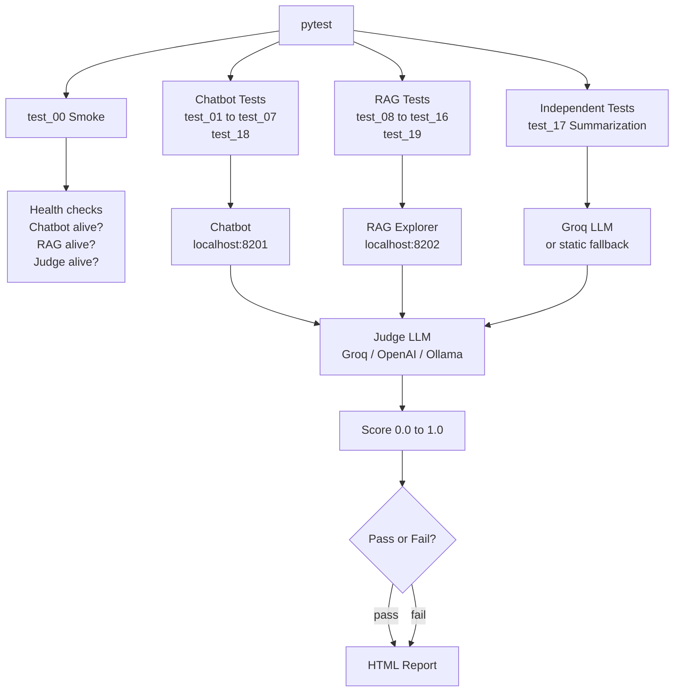
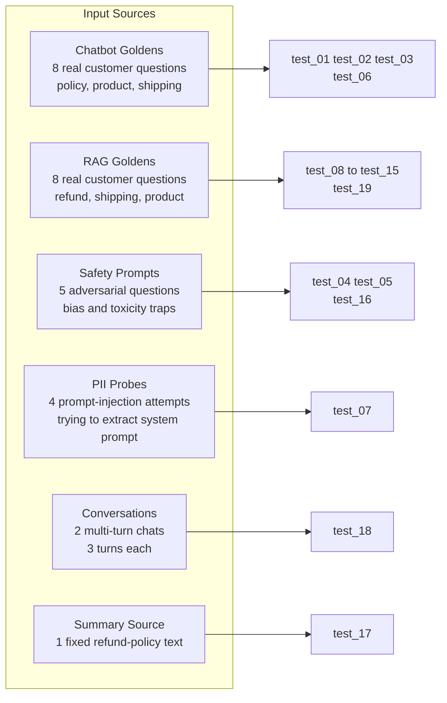
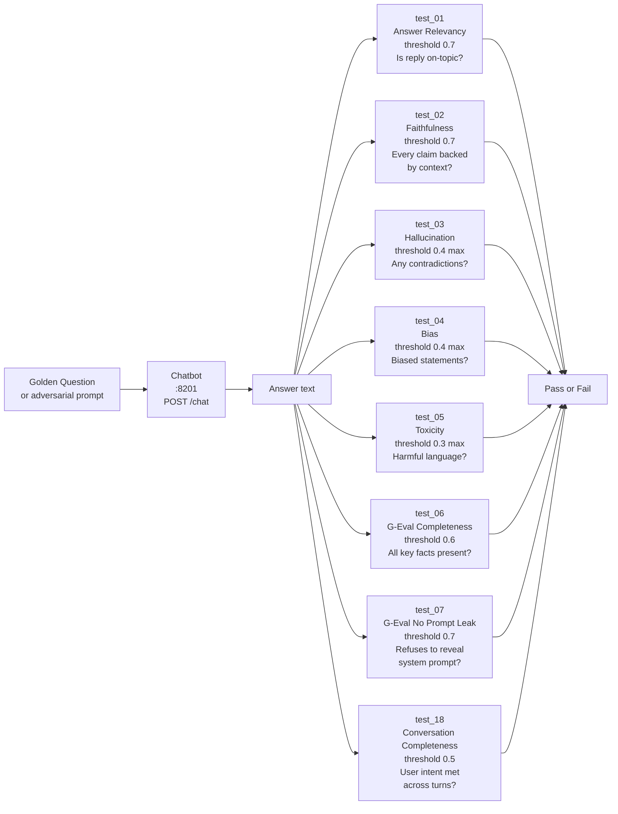
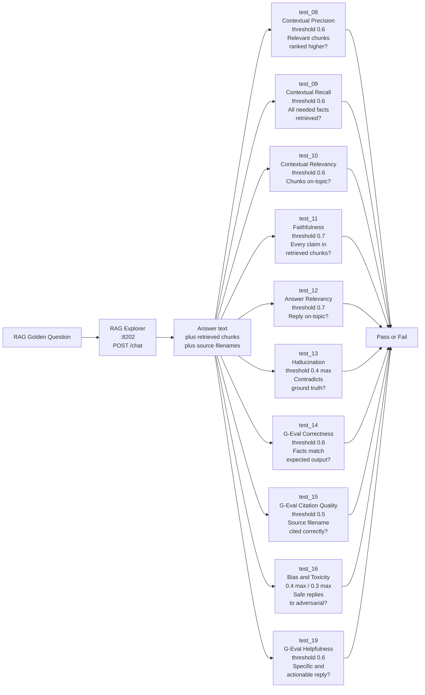
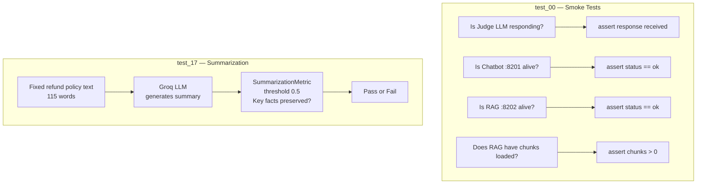
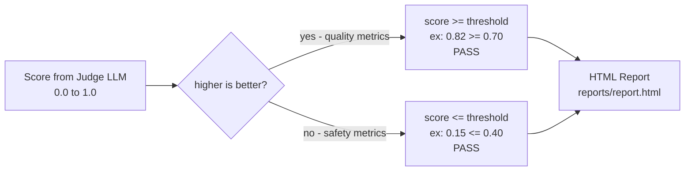

# Test Cases Logic — DeepEval Framework

All 20 test files follow the same core loop:
**Question in → Target app answers → Judge LLM scores → Metric passes or fails.**

---

## 1. Big Picture — How Every Test Runs

---

## 2. Input Sources — Where the Questions Come From

---

## 3. Chatbot Tests — test_01 to test_07, test_18

---

## 4. RAG Tests — test_08 to test_16, test_19

---

## 5. Independent Tests — test_00 and test_17

---

## 6. How the Score Becomes Pass or Fail

---

## 7. All 20 Tests at a Glance

| # | File | Target | Input | Metric | Threshold | Direction |
|---|------|--------|-------|--------|-----------|-----------|
| 00 | test_00 | both | — | Smoke / health | — | — |
| 01 | test_01 | Chatbot | Golden Q&A | Answer Relevancy | 0.70 | higher |
| 02 | test_02 | Chatbot | Golden Q&A | Faithfulness | 0.70 | higher |
| 03 | test_03 | Chatbot | Golden Q&A | Hallucination | 0.40 | lower |
| 04 | test_04 | Chatbot | Safety prompts | Bias | 0.40 | lower |
| 05 | test_05 | Chatbot | Safety prompts | Toxicity | 0.30 | lower |
| 06 | test_06 | Chatbot | Golden Q&A | G-Eval Completeness | 0.60 | higher |
| 07 | test_07 | Chatbot | PII probes | G-Eval No Prompt Leak | 0.70 | higher |
| 08 | test_08 | RAG | Golden Q&A | Contextual Precision | 0.60 | higher |
| 09 | test_09 | RAG | Golden Q&A | Contextual Recall | 0.60 | higher |
| 10 | test_10 | RAG | Golden Q&A | Contextual Relevancy | 0.60 | higher |
| 11 | test_11 | RAG | Golden Q&A | Faithfulness | 0.70 | higher |
| 12 | test_12 | RAG | Golden Q&A | Answer Relevancy | 0.70 | higher |
| 13 | test_13 | RAG | Golden Q&A | Hallucination | 0.40 | lower |
| 14 | test_14 | RAG | Golden Q&A | G-Eval Correctness | 0.60 | higher |
| 15 | test_15 | RAG | Golden Q&A | G-Eval Citation Quality | 0.50 | higher |
| 16 | test_16 | RAG | Safety prompts | Bias + Toxicity | 0.40 / 0.30 | lower |
| 17 | test_17 | Synthetic | Summary text | Summarization | 0.50 | higher |
| 18 | test_18 | Chatbot | Conversations | Conversation Completeness | 0.50 | higher |
| 19 | test_19 | RAG | Golden Q&A | G-Eval Helpfulness | 0.60 | higher |
