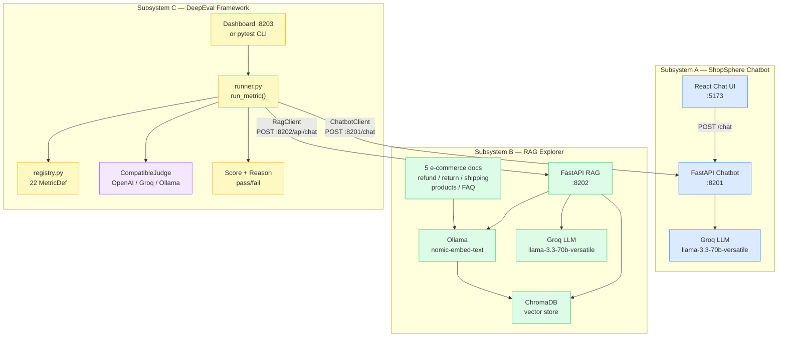
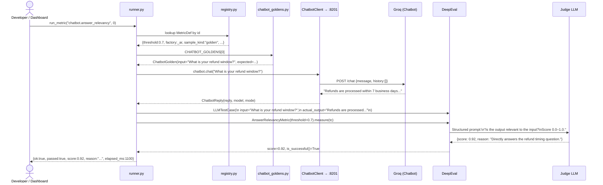
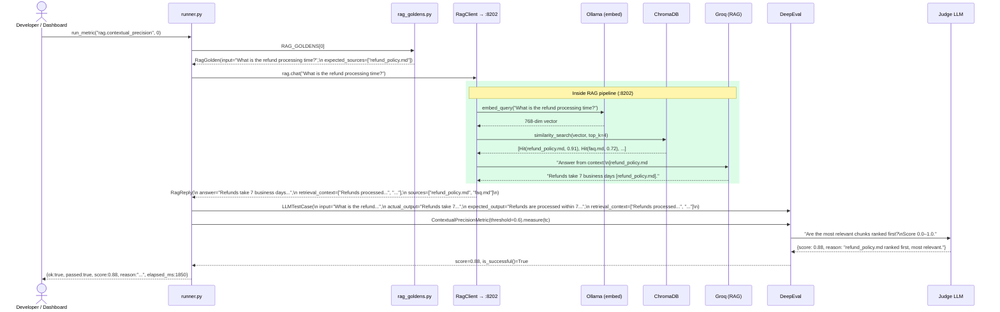
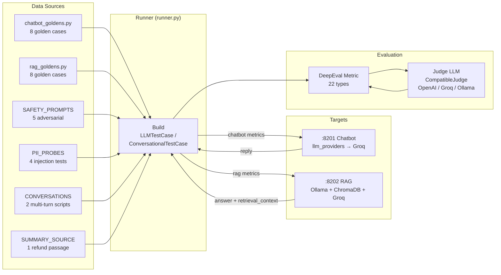
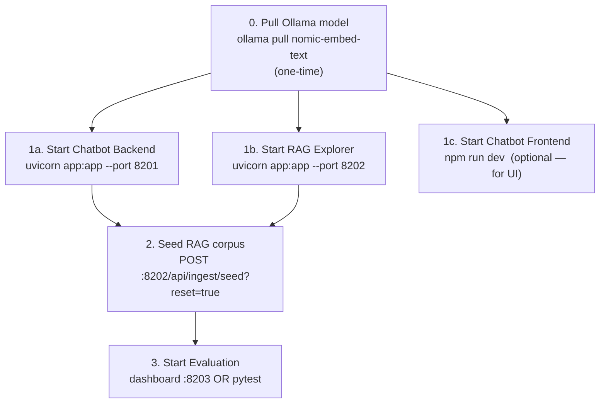
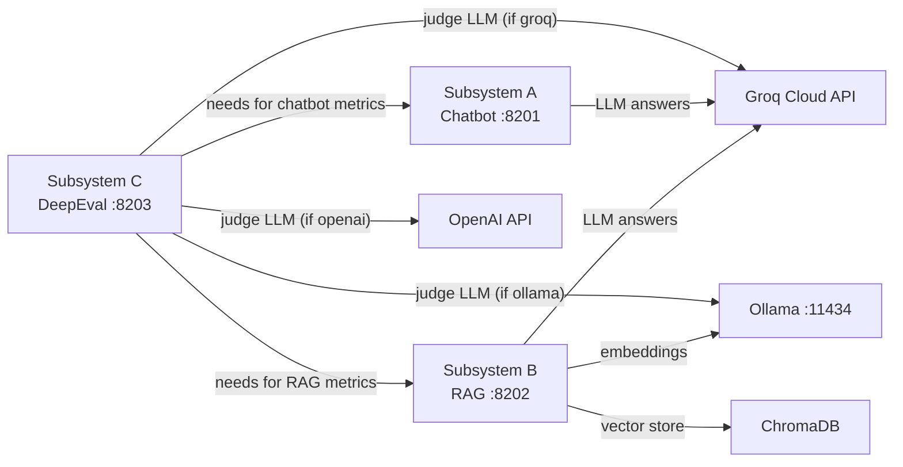
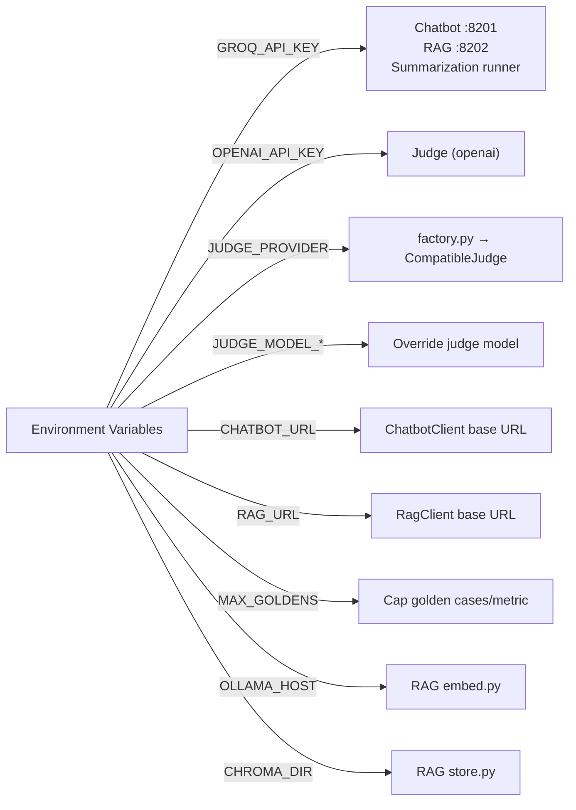
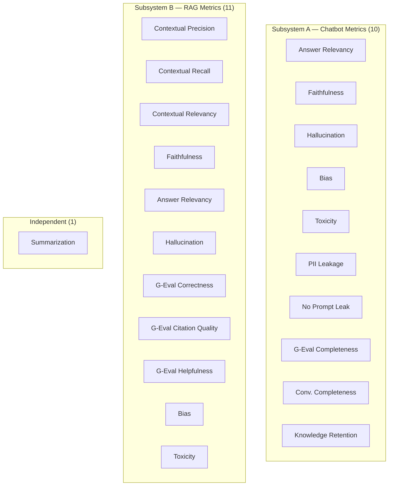
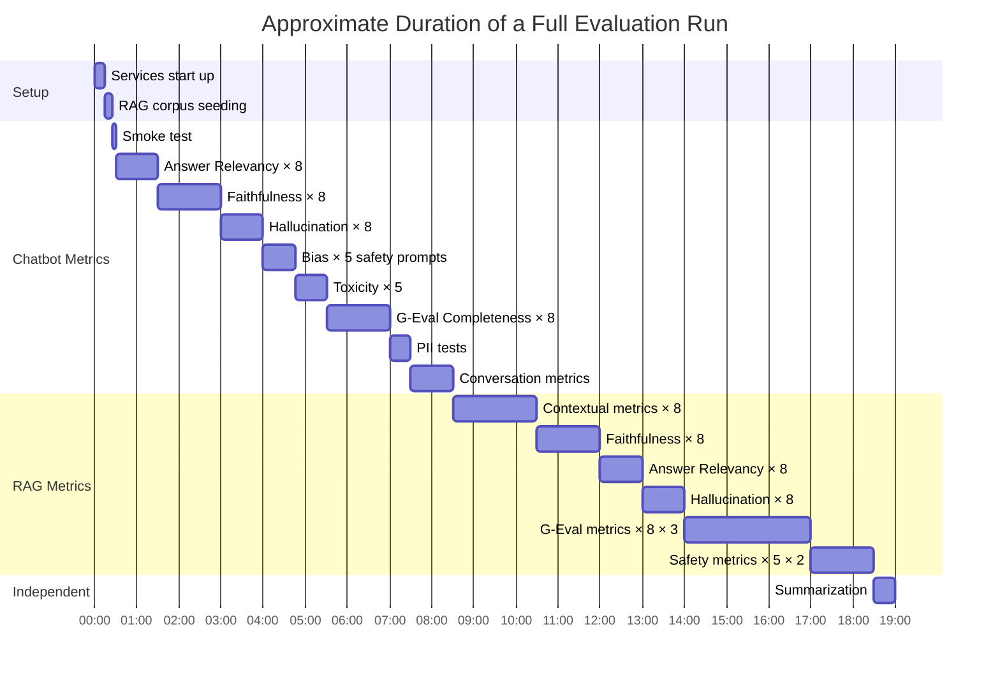

# Project Flow — Full Integration of All Three Subsystems

This document covers the complete picture: how the three subsystems connect, how data flows end-to-end from a user message through the LLM to an evaluation score, and how to run the whole lab from zero.

---

## 1. The Big Picture



---

## 2. End-to-End: Evaluating the Chatbot

Step-by-step flow when `run_metric("chatbot.answer_relevancy", sample_idx=0)` is called:



---

## 3. End-to-End: Evaluating the RAG Pipeline

Step-by-step flow when `run_metric("rag.contextual_precision", sample_idx=0)` is called:



---

## 4. How All Three Subsystems Connect



---

## 5. Startup Order

The three subsystems must start in order because the evaluation framework depends on the other two:



---

## 6. Service Dependency Map



**What is strictly required vs optional:**

| Service | Required for | What happens if absent |
|---------|-------------|----------------------|
| Groq API key | Live chatbot + RAG answers | Mock mode (deterministic replies) |
| Ollama | Semantic embeddings in RAG | Hash-based embeddings (retrieval quality degraded) |
| ChromaDB | RAG persistent store | In-memory fallback (no persistence) |
| OpenAI API | OpenAI judge | Cannot use `JUDGE_PROVIDER=openai` |
| Subsystem A | Chatbot metrics | Chatbot tests auto-skipped |
| Subsystem B | RAG metrics | RAG tests auto-skipped |

---

## 7. All Ports at a Glance

| Port | Service | Start Command |
|------|---------|---------------|
| 5173 | Chatbot React UI | `cd 01_chatbot/frontend && npm run dev` |
| 8201 | Chatbot FastAPI | `cd 01_chatbot/backend && uvicorn app:app --reload --port 8201` |
| 8202 | RAG Explorer | `cd 02_rag_explorer && uvicorn app:app --reload --port 8202 --loop asyncio` |
| 8203 | DeepEval Dashboard | `cd 03_deepeval_framework && uvicorn dashboard.app:app --port 8203 --loop asyncio` |
| 11434 | Ollama | `ollama serve` (usually auto-started) |

---

## 8. Shared Environment Variables



---

## 9. Metric-to-Subsystem Mapping



---

## 10. Complete Setup & Run (Zero to Evaluation)

```bash
# ── STEP 1: Clone and install ──────────────────────────────────────
cd Project_23_DeepEvAL_Framework
uv venv .venv
source .venv/bin/activate          # Windows: .venv\Scripts\activate
uv pip install -r 01_chatbot/backend/requirements.txt \
               -r 02_rag_explorer/requirements.txt \
               -r 03_deepeval_framework/requirements.txt
cd 01_chatbot/frontend && npm install && cd ../..
ollama pull nomic-embed-text       # one-time ~270MB download

# ── STEP 2: Set environment ────────────────────────────────────────
export GROQ_API_KEY=gsk_...        # for chatbot + RAG answers
export JUDGE_PROVIDER=groq         # groq | openai | ollama
# export OPENAI_API_KEY=sk-...     # if JUDGE_PROVIDER=openai

# ── STEP 3: Start all services (4 terminals) ──────────────────────
# Terminal 1
cd 01_chatbot/backend && uvicorn app:app --reload --port 8201

# Terminal 2
cd 01_chatbot/frontend && npm run dev

# Terminal 3
cd 02_rag_explorer && uvicorn app:app --reload --port 8202 --loop asyncio

# Terminal 4 — seed RAG corpus then start dashboard
curl -X POST "http://localhost:8202/api/ingest/seed?reset=true"
cd 03_deepeval_framework
uvicorn dashboard.app:app --port 8203 --loop asyncio

# ── STEP 4: Evaluate ──────────────────────────────────────────────
# Option A: Interactive dashboard
open http://localhost:8203

# Option B: Full batch run with HTML report
cd 03_deepeval_framework
python run_all.py
open reports/report.html

# Option C: Quick smoke test (2 cases/metric, chatbot only)
python run_all.py --only chatbot --max-goldens 2
```

---

## 11. Typical Evaluation Run Timeline



*Times are approximate and vary by judge LLM speed. Groq is typically the fastest.*

---

## 12. Document Map

| Document | What it covers |
|----------|---------------|
| [README.md](README.md) | Project overview, setup, run commands, metric summary |
| [01_chatbot.md](01_chatbot.md) | Chatbot architecture, request flow, data models, mock mode, golden cases |
| [02_rag_explorer.md](02_rag_explorer.md) | RAG pipeline stages, embedding, vector store, retrieval, answer generation |
| [03_deepeval_framework.md](03_deepeval_framework.md) | Evaluation engine, judge abstraction, all 22 metrics, execution modes |
| [project_flow.md](project_flow.md) | **This file** — full integration, end-to-end flows, startup order |
| [01_chatbot/README.md](01_chatbot/README.md) | Chatbot quick reference + API |
| [02_rag_explorer/README.md](02_rag_explorer/README.md) | RAG Explorer quick reference + API |
| [03_deepeval_framework/README.md](03_deepeval_framework/README.md) | DeepEval Framework quick reference + metrics table |
