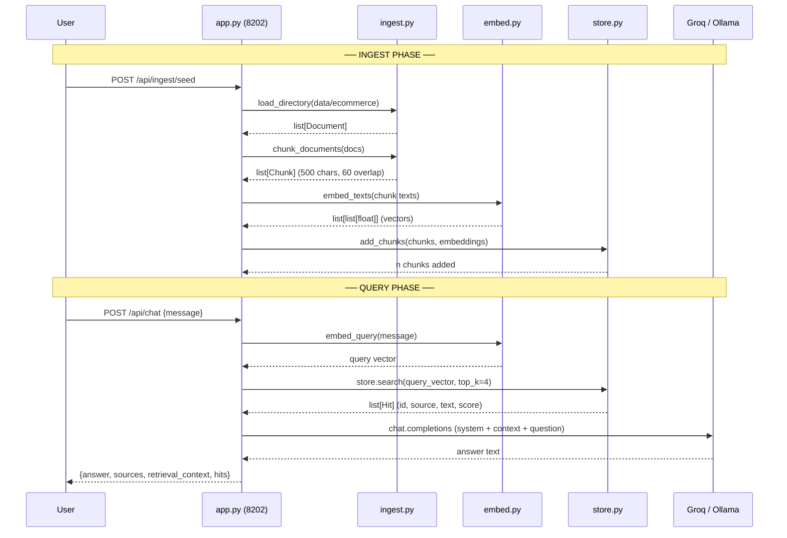
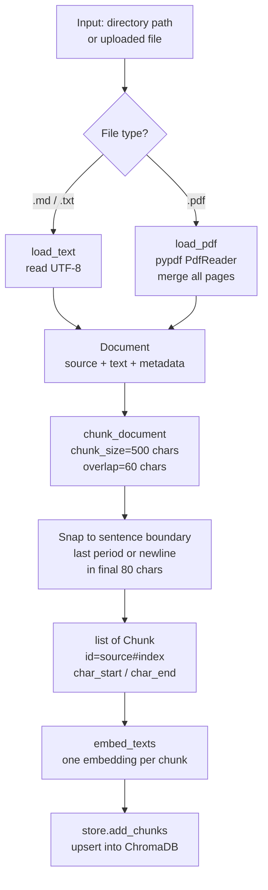
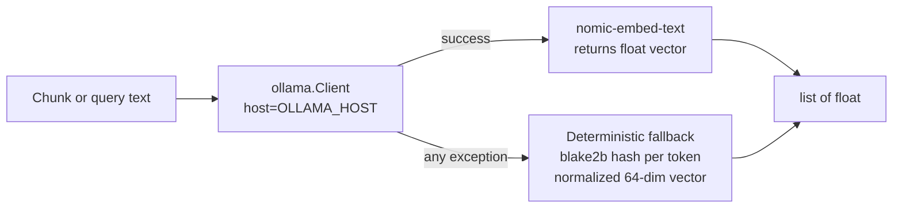
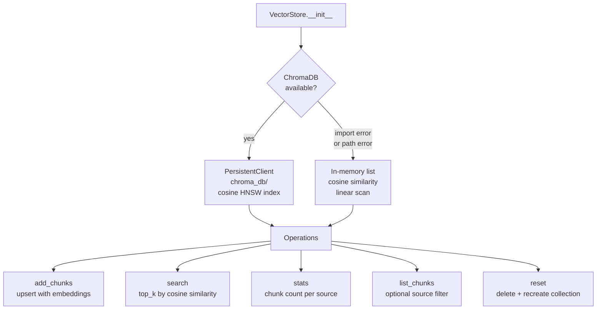
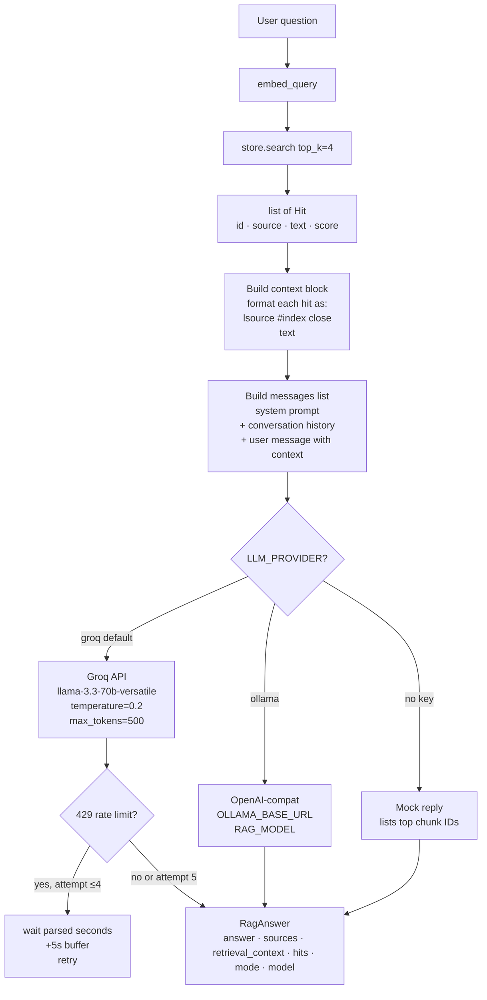
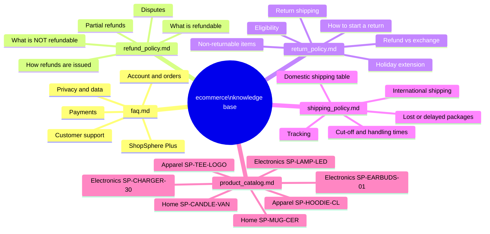
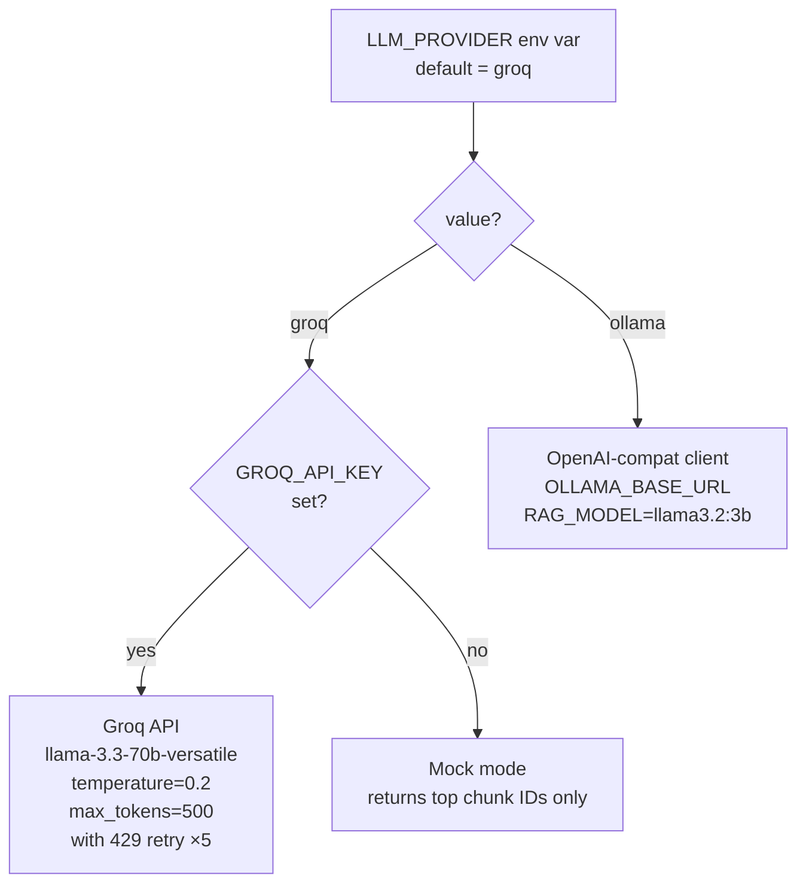
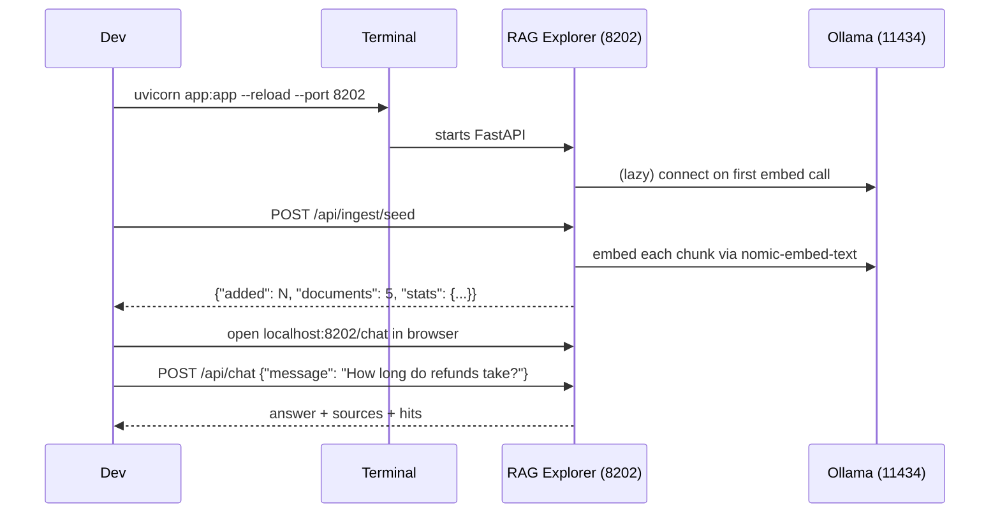

# RAG Explorer — Subsystem B

ShopSphere RAG (Retrieval-Augmented Generation) pipeline. A FastAPI app on port **8202** that retrieves relevant policy/product chunks from a vector store and uses a live LLM to answer e-commerce questions — grounded strictly in the retrieved context.

---

## Table of Contents

1. [Project Structure](#1-project-structure)
2. [System Architecture](#2-system-architecture)
3. [Full Pipeline — End to End](#3-full-pipeline--end-to-end)
4. [Ingestion Pipeline](#4-ingestion-pipeline)
5. [Embedding](#5-embedding)
6. [Vector Store](#6-vector-store)
7. [Chat / Answer Generation](#7-chat--answer-generation)
8. [API Endpoints](#8-api-endpoints)
9. [UI Pages](#9-ui-pages)
10. [Knowledge Base — Source Documents](#10-knowledge-base--source-documents)
11. [LLM Provider Selection](#11-llm-provider-selection)
12. [Starting the RAG Explorer](#12-starting-the-rag-explorer)
13. [Environment Variables](#13-environment-variables)

---

## 1. Project Structure

```
02_rag_explorer/
├── app.py                        # FastAPI app — all routes and startup
├── rag/
│   ├── __init__.py
│   ├── ingest.py                 # Document loaders + chunker
│   ├── embed.py                  # Embedding via Ollama (+ deterministic fallback)
│   ├── store.py                  # VectorStore — ChromaDB or in-memory fallback
│   └── chat.py                   # answer_with_rag() — retrieve → format → LLM
├── data/
│   └── ecommerce/                # Seed knowledge base (5 Markdown files)
│       ├── faq.md
│       ├── refund_policy.md
│       ├── return_policy.md
│       ├── shipping_policy.md
│       └── product_catalog.md
├── data/uploads/                 # User-uploaded documents (runtime)
├── chroma_db/                    # ChromaDB persistent store (auto-created)
├── templates/
│   ├── index.html                # Home page
│   ├── ingest.html               # Ingest page
│   ├── search.html               # Raw vector search page
│   └── chat.html                 # Chat page
└── static/
```

---

## 2. System Architecture

```mermaid
graph TD
    subgraph Browser
        UI[Web UI\nindex / ingest / search / chat pages]
    end

    subgraph Port 8202 — RAG Explorer
        APP[app.py\nFastAPI]
        ING[ingest.py\nload + chunk]
        EMB[embed.py\nOllama embeddings]
        STO[store.py\nVectorStore]
        CHA[chat.py\nanswer_with_rag]
    end

    subgraph Embedding Model
        OLL_EMB[Ollama\nnomic-embed-text\nlocalhost:11434]
        FALLBACK[Deterministic fallback\nblake2b hash vectors]
    end

    subgraph LLM Answer
        GROQ[Groq Cloud\nllama-3.3-70b-versatile]
        OLL_LLM[Ollama\nllama3.2:3b]
        MOCK[Mock mode]
    end

    subgraph Vector DB
        CHROMA[ChromaDB\npersistent\nchroma_db/]
        MEMORY[In-memory\ncosine fallback]
    end

    UI -->|POST /api/ingest/seed\nPOST /api/ingest/upload| APP
    UI -->|POST /api/search\nGET /search| APP
    UI -->|POST /api/chat\nGET /chat| APP

    APP --> ING --> EMB
    EMB -->|embed_texts| OLL_EMB
    OLL_EMB -->|failure| FALLBACK
    EMB --> STO
    STO --> CHROMA
    CHROMA -->|failure| MEMORY

    APP --> CHA
    CHA -->|embed_query| EMB
    CHA -->|store.search| STO
    CHA -->|generate answer| GROQ
    GROQ -->|no key| MOCK
    CHA -->|LLM_PROVIDER=ollama| OLL_LLM
```

---

## 3. Full Pipeline — End to End



---

## 4. Ingestion Pipeline

### Flow



### Chunker Details

| Parameter | Value | Effect |
|-----------|-------|--------|
| `chunk_size` | 500 chars | Max characters per chunk |
| `overlap` | 60 chars | Each chunk re-uses last 60 chars of the previous chunk to preserve sentence context across boundaries |
| Sentence snapping | last 80 chars | Looks for the last `. ` or `\n` in the final 80 chars to avoid mid-sentence cuts |

**Chunk ID format:** `filename.md#0`, `filename.md#1`, … (zero-indexed per source)

---

## 5. Embedding



| Setting | Default | Override |
|---------|---------|----------|
| Embed model | `nomic-embed-text` | `EMBED_MODEL` env var |
| Ollama host | `http://localhost:11434` | `OLLAMA_HOST` env var |

**Fallback embedding** (when Ollama is unavailable): each token is hashed with `blake2b`, mapped to two positions in a 64-dim vector, then L2-normalised. Semantically meaningless but allows the pipeline to run without Ollama for smoke tests.

---

## 6. Vector Store



### ChromaDB Settings

| Setting | Value |
|---------|-------|
| Directory | `chroma_db/` (relative to `02_rag_explorer/`) |
| Collection | `ecommerce_kb` |
| Distance metric | Cosine (HNSW) |
| Score conversion | `score = 1.0 - distance` (so higher = more similar) |
| Telemetry | Disabled (`anonymized_telemetry=False`) |

---

## 7. Chat / Answer Generation

### Retrieve → Format → Generate



### System Prompt (RAG)

The RAG system prompt is intentionally strict to ensure the model only uses retrieved context:

```
You are ShopBot for ShopSphere, an e-commerce store.
Answer ONLY using the retrieved context below.
If the answer is not in the context, say
"I don't have that information in my knowledge base — please contact support@shopsphere.com."

- Be concise (under 150 words).
- Quote exact figures from the context — do not invent numbers, SKUs, or timeframes.
- Cite sources inline like [refund_policy.md].
```

### RagAnswer Fields

| Field | Type | Description |
|-------|------|-------------|
| `answer` | `str` | LLM-generated reply |
| `sources` | `list[str]` | Unique source filenames from retrieved hits |
| `retrieval_context` | `list[str]` | Raw text of each retrieved chunk |
| `hits` | `list[Hit]` | Full hit objects with id, source, score, metadata |
| `mode` | `str` | `live` / `ollama` / `mock` |
| `model` | `str` | Model name used for generation |

---

## 8. API Endpoints

| Method | Path | Description |
|--------|------|-------------|
| `GET` | `/api/health` | Store stats + embed model info + Groq configured flag |
| `POST` | `/api/ingest/seed` | Load + chunk + embed all docs in `data/ecommerce/`; `?reset=true` to wipe first |
| `POST` | `/api/ingest/upload` | Upload a file (PDF/TXT/MD), chunk + embed it; `reset` form field |
| `POST` | `/api/ingest/reset` | Delete all chunks from the vector store |
| `POST` | `/api/search` | Embed a query and return top-k hits with scores |
| `POST` | `/api/chat` | Full RAG answer — returns answer, sources, retrieval_context, hits |
| `GET` | `/api/chunks` | List stored chunks; `?source=filename.md` to filter |
| `GET` | `/api/stats` | Chunk count per source + collection name |

### `/api/chat` Request / Response

**Request:**
```json
{
  "message": "How long do refunds take?",
  "top_k": 4,
  "history": []
}
```

**Response:**
```json
{
  "answer": "Refunds are processed within 7 business days of receiving the returned item [refund_policy.md].",
  "sources": ["refund_policy.md"],
  "retrieval_context": ["ShopSphere processes refunds within 7 business days ..."],
  "hits": [
    { "id": "refund_policy.md#0", "source": "refund_policy.md", "score": 0.9142, "text": "..." }
  ],
  "mode": "live",
  "model": "llama-3.3-70b-versatile"
}
```

### `/api/search` Request / Response

**Request:**
```json
{ "query": "overnight shipping cost", "top_k": 3 }
```

**Response:**
```json
{
  "query": "overnight shipping cost",
  "hits": [
    {
      "id": "shipping_policy.md#1",
      "source": "shipping_policy.md",
      "score": 0.8873,
      "text": "Overnight | $24.99 | Next business day if ordered before 12pm ET",
      "metadata": { "source": "shipping_policy.md", "index": 1, "char_start": 312, "char_end": 498 }
    }
  ]
}
```

---

## 9. UI Pages

```mermaid
flowchart LR
    HOME[/ — Home\nstore stats\nembed model info] --> INGEST
    HOME --> SEARCH
    HOME --> CHAT

    INGEST[/ingest — Ingest page\nlist seed files\nupload new docs\nview all chunks]

    SEARCH[/search — Search page\nenter query\nview top-k hits\nwith scores and source]

    CHAT[/chat — Chat page\nmulti-turn conversation\nshows sources per reply]
```

| Page | Path | What you can do |
|------|------|----------------|
| **Home** | `/` | See chunk count per source, embed model, Groq status |
| **Ingest** | `/ingest` | Seed from `data/ecommerce/`, upload files, view/reset chunks |
| **Search** | `/search` | Raw vector search — inspect what chunks are retrieved for any query |
| **Chat** | `/chat` | Full RAG chat with source citations per answer |

---

## 10. Knowledge Base — Source Documents

All 5 seed files live in `02_rag_explorer/data/ecommerce/`.



### File Summary

| File | Key Facts |
|------|-----------|
| `faq.md` | Payment methods, loyalty program ($9.99/month ShopSphere Plus), account deletion (privacy@shopsphere.com), Affirm financing (orders over $100) |
| `refund_policy.md` | 7 business days to process; credit-card 3-5 days; PayPal 1-2 days; no refund on digital downloads / final-sale / personalised; partial refund up to 50% for used items |
| `return_policy.md` | 30-day return window; non-returnable: underwear, earbuds, personalised, gift cards, perishables; holiday extension Nov 1 – Dec 24 → Jan 31 |
| `shipping_policy.md` | Standard free over $50 (5-7 days); Express $9.99 (2-3 days); Overnight $24.99 (next day before 12pm ET); prohibited: Russia, North Korea, Iran, Syria, Cuba |
| `product_catalog.md` | 7 SKUs: earbuds $79, lamp $39, charger $24.99, hoodie $49, tee $22, mug $14, candle $18 |

---

## 11. LLM Provider Selection



| Provider | Model | Key required | Notes |
|----------|-------|-------------|-------|
| `groq` (default) | `llama-3.3-70b-versatile` | `GROQ_API_KEY` | Rate-limit retry with back-off up to 5 attempts |
| `ollama` | `llama3.2:3b` | none | Fully local; uses OpenAI-compatible endpoint |
| mock | — | none | Falls back when Groq key absent; returns chunk IDs only |

---

## 12. Starting the RAG Explorer



### Commands

```powershell
# from project root
cd D:\POC\Project_23_DeepEvAL_Framework\02_rag_explorer
uvicorn app:app --reload --port 8202
```

### First-time setup — seed the knowledge base

After starting the server, trigger ingestion once (or use the Ingest page in the browser):

```powershell
# seed all 5 docs from data/ecommerce/
Invoke-RestMethod -Method POST http://localhost:8202/api/ingest/seed

# force reset and re-ingest
Invoke-RestMethod -Method POST "http://localhost:8202/api/ingest/seed?reset=true"
```

Or open `http://localhost:8202/ingest` and click **Seed from ecommerce/**.

---

## 13. Environment Variables

| Variable | Default | Used in | Description |
|----------|---------|---------|-------------|
| `LLM_PROVIDER` | `groq` | `chat.py` | `groq` or `ollama` |
| `GROQ_API_KEY` | _(empty)_ | `chat.py` | Groq API key; without it RAG runs in mock mode |
| `RAG_MODEL` | `llama-3.3-70b-versatile` (groq) / `llama3.2:3b` (ollama) | `chat.py` | Override the generation model |
| `OLLAMA_BASE_URL` | `http://localhost:11434/v1` | `chat.py` | Ollama OpenAI-compatible endpoint |
| `EMBED_MODEL` | `nomic-embed-text` | `embed.py` | Ollama embedding model name |
| `OLLAMA_HOST` | `http://localhost:11434` | `embed.py` | Ollama host for embeddings |
| `CHROMA_DIR` | `02_rag_explorer/chroma_db` | `store.py` | ChromaDB persistence path |
| `CHROMA_COLLECTION` | `ecommerce_kb` | `store.py` | ChromaDB collection name |
